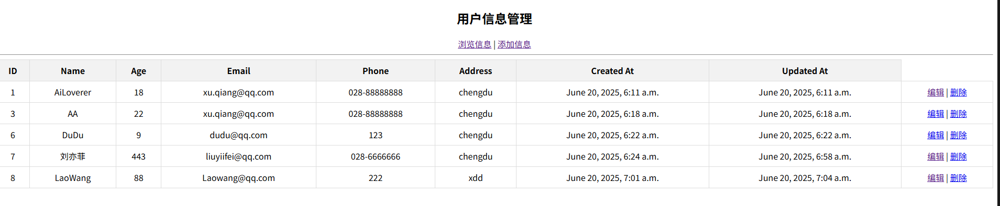

# Django-Model-Demo
Django's model demo about how to create a project, create models, and perform CRUD operations.

## Picture
  

# Project Structure

```
说明：  
1. 本人是在Windows系统下使用WSL2 Ubuntu 20.04进行Django项目的开发，使用了虚拟环境venv。因此目录结构可能与您的操作系统有所不同。Linux系统下Django项目的目录结构与此相同。  
2.Linux下Python命令可能是Python3，Windows下可能是Python。
```

```
modelproject/
    venv/
        bin/
            activate
    manage.py
    modelproject/
        __init__.py
        settings.py
        urls.py
        wsgi.py
    modelapp/
        __init__.py
        admin.py
        apps.py
        migrations/
            __init__.py
        models.py
        tests.py
        views.py
```
# How to Create and Run the Project
## Step 1: Create a Virtual Environment
```
python -m venv venv
```

## Step 2: Activate the Virtual Environment
```
source venv/bin/activate
```

## Step 3: Install Django
```
pip install django
```

## Step 4: Create a Django Project
```
django-admin startproject modelproject
```

## Step 5: Create a Django App
```
python manage.py startapp modelapp
```
add "modelapp" to INSTALLED_APPS in modelproject/settings.py
```
INSTALLED_APPS = [
   ...
   'modelapp',
]
```

## Step 6: Run the Server
```
python manage.py runserver
```
# Development Process Of The Project Bessiness Logic
## Step 1: Create a Model
Path:
```
modelapp/models.py
```
Code:
```
from django.db import models

class Person(models.Model):
    name = models.CharField(max_length=50)
    age = models.IntegerField()
    email = models.EmailField()
    phone = models.CharField(max_length=20)
    address = models.CharField(max_length=100)
    created_at = models.DateTimeField(default=datetime.now)
    updated_at = models.DateTimeField(default=datetime.now)
```

## Step 2: Run the Migrations
```
python manage.py makemigrations
python manage.py migrate
```

## Step 3: Create a View

Path:
``` 
modelapp/views.py   
```
Code:
```
from django.shortcuts import render
from modelapp.models import Person
from django.http import HttpResponse
from django.shortcuts import render, redirect
from django.urls import reverse
from modelapp.models import Person
from datetime import datetime

# Create your views here.

def index(request):
    persons = Person.objects.all()
    #return HttpResponse("Hello, world. You're at the modelapp index.")
    #return render(request, 'index.html', {'persons': persons})
    return HttpResponse('<h1>首页</h1><a href="/users">用户信息管理</a>')

def person_list(request):
    try:
        persons = Person.objects.all()
        return render(request, 'modelapp/person/index.html', {'persons': persons})
    except Person.DoesNotExist:
        persons = None
        return HttpResponse('<h1>没有任何用户信息</h1><a href="/users/person_add">创建用户信息</a>')
    

def person_add(request):
    return render(request, 'modelapp/person/add.html')

def person_insert(request):
    if request.method == 'POST':
        try:
            name = request.POST['name']
            print(name)
            age = request.POST['age']
            email = request.POST['email']
            phone = request.POST['phone']
            address = request.POST['address']
            person = Person(name=name, age=age, email=email, phone=phone, address=address)
            person.save()
            context = {'info': '添加成功'}
            print(context)
            print(person)
        except:
            context = {'info': '添加失败'}
            print(context)
        return render(request, 'modelapp/person/info.html', context)
def person_edit(request, pk):
    try:
        person = Person.objects.get(id=pk)
        context = {'person': person}
        return render(request, 'modelapp/person/edit.html', context)
    except :
        context = {'info': '没有该用户信息'}
        return render(request, 'modelapp/person/info.html', context)

def person_update(request):
    print('person_update')
    try:
        person = Person.objects.get(id = request.POST['id'])
        person.name = request.POST['name']
        person.age = request.POST['age']
        person.email = request.POST['email']
        person.phone = request.POST['phone']    
        person.address = request.POST['address']
        person.updated_at = datetime.now()
        person.save()
        context = {'info': '更新成功'}
        return render(request, 'modelapp/person/info.html', context)
    except:
        context = {'info': '更新失败'}
        return render(request, 'modelapp/person/info.html', context)

def person_delete(request, pk):
    try:
        person = Person.objects.get(id=pk)
        person.delete()
        context = {'info': '删除成功'}
    except: 
        context
    return render(request, 'modelapp/person/info.html', context)
    
```

## Step 4: Create a Template

Path:
```
modelapp/templates/index.html
```
Code:
```
<body>
    <div class="center-content">
        <h2>用户信息管理</h2>
        <a href="">浏览信息</a> |
        <a href="">添加信息</a>
        <hr/>
        <table>
            <thead>                        
                <tr>
                    <th>ID</th>                
                    <th>Name</th>                
                    <th>Age</th>                
                    <th>Email</th>                                                
                    <th>Phone</th>
                    <th>Address</th>
                    <th>Created At</th>                
                    <th>Updated At</th>                
                </tr>
            </thead>
            <tbody>            
                
                    <tr>
                        <td>{{ person.id }}</td>
                        <td>{{ person.name }}</td>
                        <td>{{ person.age }}</td>
                        <td>{{ person.email }}</td>
                        <td>{{ person.phone }}</td>
                        <td>{{ person.address }}</td>
                        <td>{{ person.created_at }}</td>
                        <td>{{ person.updated_at }}</td>
                        <td>
                            <a href="">编辑</a> |
                            <a href="">删除</a>
                        </td>
                    </tr>
                
            </tbody>
        </table>
    </div>
</body>
```

## Step 5: Create a URL
```
from django.contrib import admin
from django.urls import path
from modelapp import views
urlpatterns = [
    path('admin/', admin.site.urls),
    path('', views.index, name="index"),
    path('users/', views.person_list, name='person_list'),
    path('users/add/', views.person_add, name='person_add'),
    path('users/insert/', views.person_insert, name='person_insert'),
    path('users/delete/<int:pk>/', views.person_delete, name='person_delete'),
    path('users/edit/<int:pk>/', views.person_edit, name='person_edit'),
    path('users/update/', views.person_update, name='person_update'),
]
```

## Step 6: Create a Template for Edit Operations
Path:
```
modelapp/templates/modelapp/person/edit.html
```
Code:
```
<body>
    <div class="center-content">
        <h2>编辑用户信息</h2>
        <form action="" method="post">
            <input type="hidden" name="id" value="{{person.id}}"/>
            
            <table>
                <tr>
                    <th>姓名:</th>
                    <td><input type="text" name="name" value="{{ person.name }}"/></td>
                </tr>
                <tr>
                    <th>年龄:</th>
                    <td><input type="text" name="age" value="{{ person.age }}"/></td>
                </tr>
                <tr>
                    <th>邮箱:</th>
                    <td><input type="text" name="email" value="{{ person.email }}"/></td>
                </tr>
                <tr>
                    <th>电话:</th>
                    <td><input type="text" name="phone" value="{{ person.phone }}"/></td>
                </tr>
                <tr>
                    <th>地址:</th>
                    <td><input type="text" name="address" value="{{ person.address }}"/></td>
                </tr>
                <tr>
                    <td colspan="2">
                        <input type="submit" value="修改"/>
                        <input type="reset" value="重置"/>
                    </td>
                </tr>
            </table>
        </form>
    </div>
</body>
```
## Step 7: Create a Template for Add Operations
Path:
```
modelapp/templates/modelapp/person/add.html
```
Code:
```
<body>
    <div class="center-content">
        <h2>添加用户信息</h2>
        <form action="" method="post">
            
            <table>
                <tr>
                    <th>姓名:</th>
                    <td><input type="text" name="name" required/></td>
                </tr>
                <tr>
                    <th>年龄:</th>
                    <td><input type="text" name="age" required/></td>
                </tr>
                <tr>
                    <th>邮箱:</th>
                    <td><input type="text" name="email" required/></td>
                </tr>
                <tr>
                    <th>电话:</th>
                    <td><input type="text" name="phone" required/></td>
                </tr>
                <tr>
                    <th>地址:</th>
                    <td><input type="text" name="address" required/></td>
                </tr>
                <tr>
                    <td colspan="2">
                        <input type="submit" value="添加"/>
                        <input type="reset" value="重置"/>                        
                    </td>
                </tr>                
            </table>            
        </form>
    </div>
</body>
```

## Step 8: Create a Template for Info Operations
Path:
```
modelapp/templates/modelapp/person/info.html
```
Code:
```
<body>
    <div class="center-content">
        <h2>{{ info }}</h2>
        <a href="">返回</a>
    </div>
</body>                
```

## Step 9: Run the Server
```
python manage.py runserver
```

# Summary
In this project, we have learned how to create a Django project, create models, and perform CRUD operations. We have also learned how to create a form, a view, and a template for CRUD operations. Finally, we have learned how to create a URL and a template for the home page.  